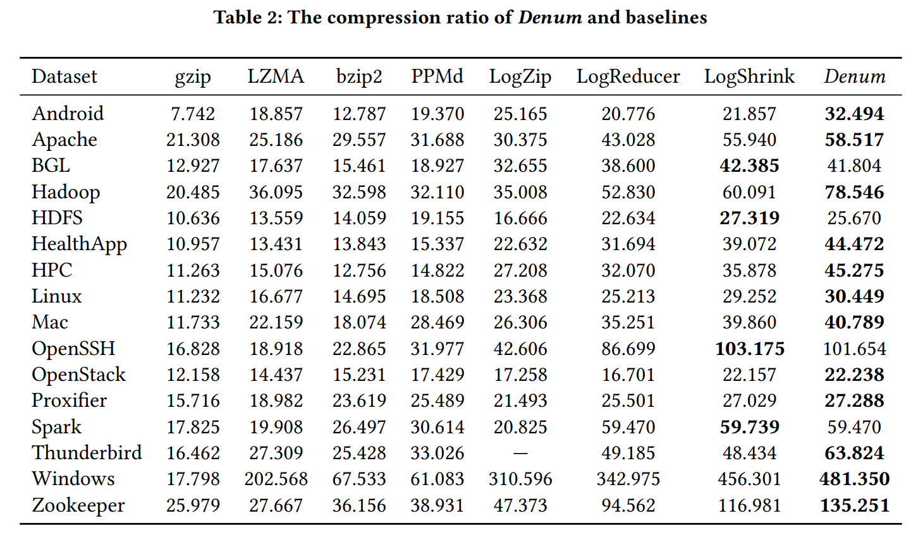
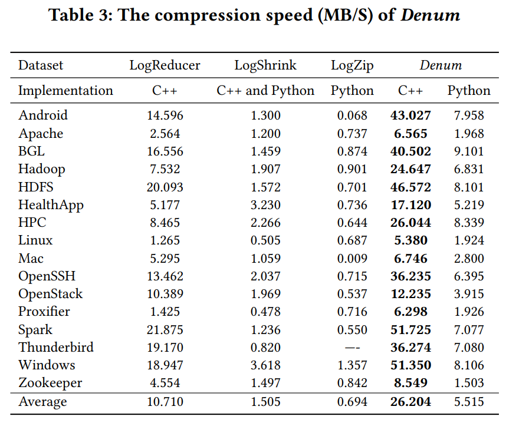
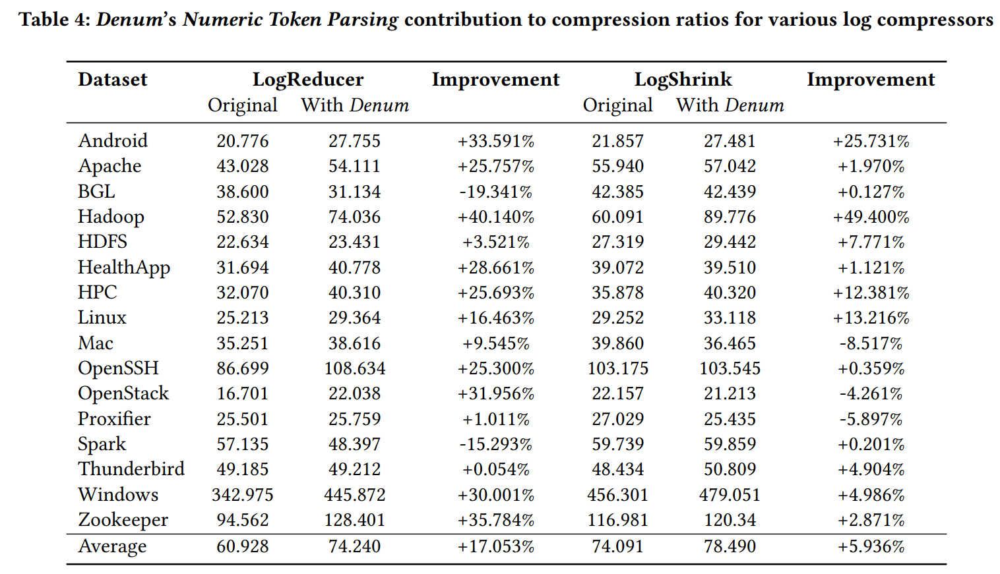
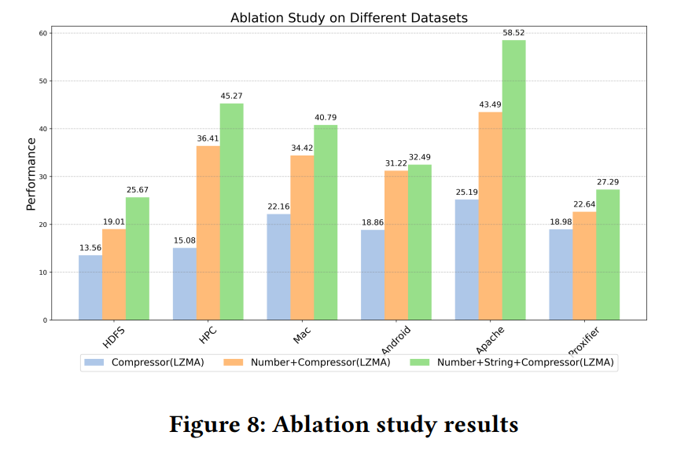

# Denum
## An Effective and Efficient Log Compressor by Parsing Numbers

##### Dataset

Loghub: 

https://github.com/logpai/loghub

download these datasets and copy them into Logs/{logname}/{logname}.log

### Compress

###  - C++ implementation

##### Dependencies

python >= 3.7.3

regex = 2012.1.8

gcc >= 9.4.0

PCRE2 = 10.34

##### 1. Compile

`g++ -O3 -std=c++17 -o denum_compress denum_compress.cpp -lboost_iostreams -lpthread -lpcre2-8`

#### 2. Execution

Assume the chunksize is set to 100000, and the target log file is Logs/HDFS/HDFS.log

`denum_compress HDFS 100000`

### - Python implementation

Assume the target log file is Logs/Apache/Apache.log

1. `cd Denum_python_package`

2. `python3 compress.py Apache`

### Decompress

1. `cd Denum_Package`

2. `python3 decompress.py Apache`

### Lossy Check

1. `cd ..`

2. `python3 lossy_check.py`

### Experiments Reproduction

Research questions:

• RQ1: What is the compression ratio of Denum?

• RQ2: What is the compression speed of Denum?

• RQ3: Can Denum’s Numeric Token Parsing module improve
the performance of other log compressors?

• RQ4: How does each module in Denum affect its compression
 ratio?

### - RQ1 & RQ2

1. download these datasets and copy them into Logs/{logname}/{logname}.log from [loghub](https://github.com/logpai/loghub)

2. Compile the code according to the previous instructions, and then run the following command: `denum_compress HDFS 100000`

3. Perform the above operations for different datasets. 

Results:

CR

CS

### - RQ3
For RQ3, the logs need to undergo Denum's number processing module, generating logs without numbers, and then applying it to other log compressors.

1. line 496 of [Denum_compress.cpp](https://anonymous.4open.science/r/Denum_ASE2024-66F3/Denum_compress.cpp), 

`std::vector\<std::string\> modified_logs = denum_processor.variable_extract(final_output, std::to_string(block_id));`,

where `modified_logs` refers to the logs without numbers. We need to store `modified_logs` .

2. Compress `modified_logs` according to the instructions in other log compressors such as [LogReducer](https://github.com/THUBear-wjy/LogReducer), [LogZip](https://github.com/logpai/logzip) and [LogShrink](https://github.com/IntelligentDDS/LogShrink)

Results:

### - RQ4

1. line 493 to 496 of [Denum_compress.cpp](https://anonymous.4open.science/r/Denum_ASE2024-66F3/Denum_compress.cpp): 

493 ` auto [final_output, final_patterns] = log_processor.replace_and_group(block);`

494 `std::string logname_dir = output_dir + "/" + std::to_string(block_id)+ "/";`

495 `ensure_directory_exists(logname_dir);`

496 `std::vector\<std::string\> modified_logs = denum_processor.variable_extract(final_output, std::to_string(block_id));`

497 `denum_processor.store_content_with_ids(modified_logs, "all", std::to_string(block_id), "lzma");`

Lines 493-496 implement number processing, while line 497 handles string processing. By controlling these parts of the statements, we can achieve ablation experiments.

Results:
